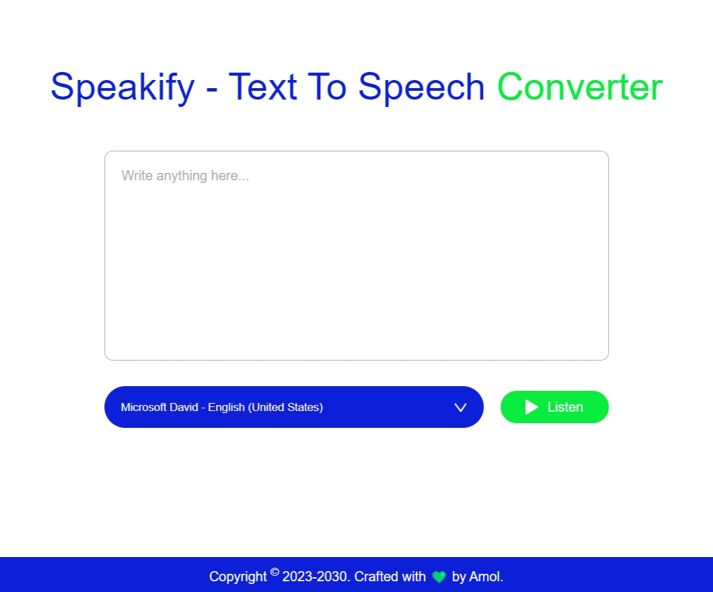

# 🎙️🔥🚀 Speakify - Text To Speech Converter Web Application 🌈🌟🎉

Welcome to **Speakify**, a simple and intuitive web application that converts text into speech. Speakify provides an easy way to listen to any text content you input, making it convenient for various purposes such as listening to articles, proofreading, or even just enjoying the sound of your favorite texts.

## 

## 

## 🛠️ Tech Stack

- 🌐 **HTML5**
- 🎨 **CSS3**
- ☕ **JavaScript**

## 🌟 Features

- 🔊 **Convert text to speech** with a click of a button.
- 🗣️ **Choose from a variety of voices** to personalize your listening experience.
- 💻 **Simple and user-friendly interface** for seamless usage.

## 🔍 How it Works

- 🗣️ **Speakify** utilizes the **Web Speech API**, a browser-based technology, to convert text into speech.
- 🎤 The **Web Speech API** provides functionalities for **speech synthesis (text-to-speech)** and **speech recognition (speech-to-text)** directly within the browser environment.
- 📝 By utilizing the **SpeechSynthesisUtterance** interface, Speakify generates speech from the text provided by the user, offering a seamless and efficient text-to-speech conversion process.

## 🔧 API Integration Details

- 🌐 **Web Speech API**: A powerful tool integrated directly into modern browsers, providing capabilities for converting text into speech and vice versa.
- 🔄 **SpeechSynthesisUtterance**: This interface is used to represent a speech request.

## 📝 Contributing

Contributions are welcome! If you have any ideas for improvements or new features, feel free to **open an issue** or **submit a pull request**. 🙌

## 👤 Author

Speakify is crafted with 💚 by **Amol**. 🌟
